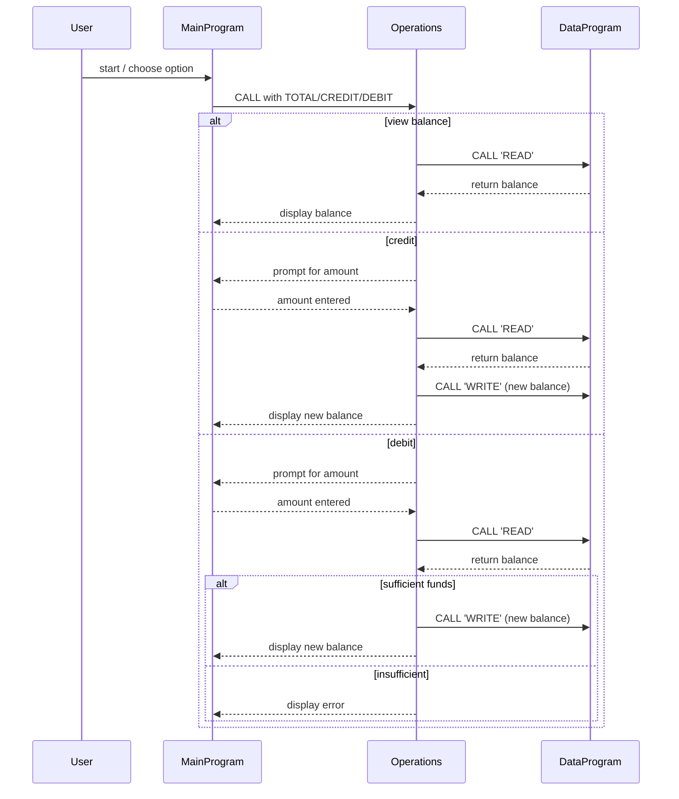

# Legacy COBOL Code – Overview

This suite of COBOL programs emulates a student account management system. All source code is located under `src/cobol/`.

## Files

### `main.cob` – Entry Point & Menu Driver
- **Purpose:** The main entry point that presents an interactive menu loop to the user.
- **Key Functions:**
  - Displays a menu with four options: View Balance, Credit Account, Debit Account, and Exit.
  - Reads the user's choice and calls the `Operations` program with the corresponding operation flag.
  - Continuously loops until the user chooses to exit.
- **Operations:**
  - Option 1: Calls `Operations` with `'TOTAL '` to view the current balance.
  - Option 2: Calls `Operations` with `'CREDIT'` to add funds to the account.
  - Option 3: Calls `Operations` with `'DEBIT '` to withdraw funds from the account.
  - Option 4: Sets the continue flag to `'NO'` and exits the program.

### `operations.cob` – Business Logic Layer
- **Purpose:** Implements the core business logic for account operations (balance inquiry, credit, debit).
- **Key Functions:**
  - **TOTAL:** Reads the current balance from `DataProgram` and displays it.
  - **CREDIT:** Prompts for an amount, reads the current balance, adds the amount, writes the new balance back, and displays the result.
  - **DEBIT:** Prompts for an amount, reads the current balance, validates that sufficient funds exist, and either deducts the amount and writes the new balance or displays an insufficient funds error.
- **Data Flow:**
  - Calls `DataProgram` with operation type (`'READ'` or `'WRITE'`) and the balance value.
  - Receives balance data back from `DataProgram` for validation and calculation.

### `data.cob` – Data Storage & Access Layer
- **Purpose:** Acts as the persistent data store for the account balance.
- **Key Functions:**
  - Maintains a single working-storage field `STORAGE-BALANCE` initialized to `1000.00`.
  - Exposes a callable procedure that either reads the stored balance or writes a new value.
  - **READ Operation:** Returns the current `STORAGE-BALANCE` to the calling program.
  - **WRITE Operation:** Updates `STORAGE-BALANCE` with the value passed from the calling program.

## Business Rules – Student Account System

1. **Initial Balance:** Every student account starts with a balance of `1000.00`.

2. **Data Format:** All balances use PIC 9(6)V99 format, allowing amounts up to `999999.99` with two decimal places.

3. **Credit Operations:** Credits (deposits) are always accepted; the amount is simply added to the current balance with no upper limit check.

4. **Debit Operations (No Overdraft Rule):** Debits (withdrawals) are only allowed when the account balance is greater than or equal to the requested debit amount. If insufficient funds exist, the transaction is rejected and the balance remains unchanged. This prevents student accounts from going into overdraft.

5. **Operation Flags:** Operations are identified by text codes:
   - `'READ'` – retrieve the current balance
   - `'WRITE'` – store a new balance
   - `'TOTAL '` – view balance (note: trailing space)
   - `'CREDIT'` – add funds (note: no trailing space)
   - `'DEBIT '` – subtract funds (note: trailing space)

6. **Session-Scoped Persistence:** The balance is stored in working-storage memory and persists only for the duration of the program session. When the program restarts, the balance resets to the initial value of `1000.00`. (In a production system, this would be replaced with a database.)

7. **User Prompts:** Interactive prompts guide users to enter amounts for credit and debit operations. Invalid menu selections are detected and an error message is displayed.

---

## Sequence Diagram

The following diagram illustrates the data flow and interactions between the three programs:

